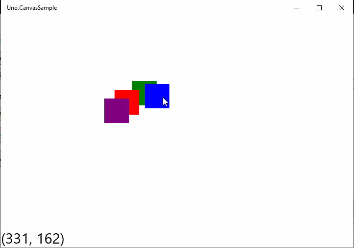
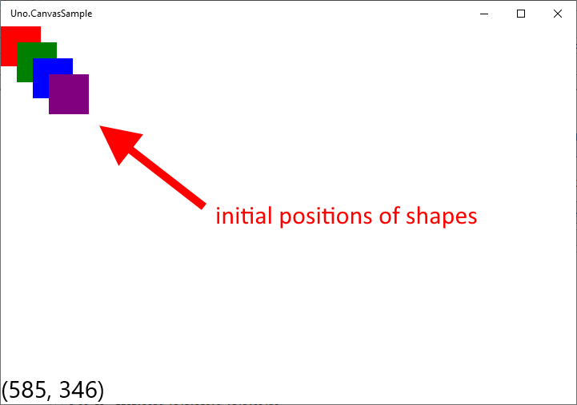
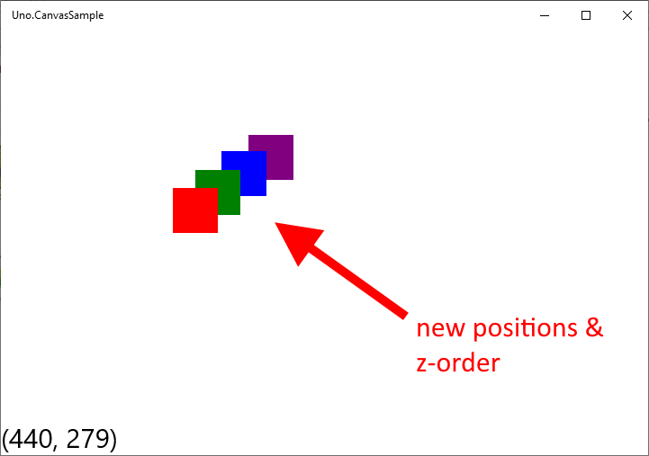

# Uno Canvas Dragging Shapes Example

An example using [Uno](https://platform.uno/) which shows:
* putting a shape on a _Canvas_
* selecting shape
* dragging shape to a new position
* changing z-order of shape

  
Initial Positons

  
  
  

  
New Positons

  
  
  

## Points of interest
* each shape hooks both _PointerReleased_ and _PointerExited_ events
  to detect when dragging has stopped.  This greatly increases stability,
  especially on the WASM head.
* Canvas.SetZIndex is broken on Linux aka Skia.Gtk
  * [Add support for Canvas.ZIndex in any Panel](https://github.com/unoplatform/uno/issues/325)

